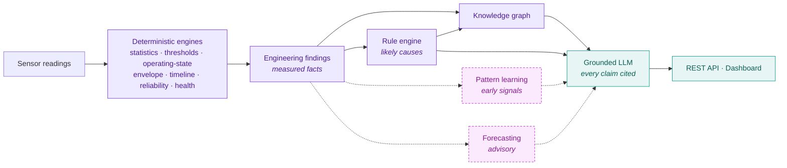
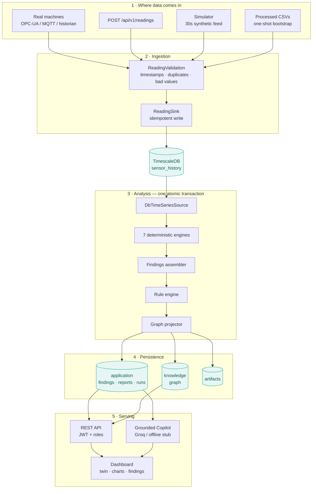
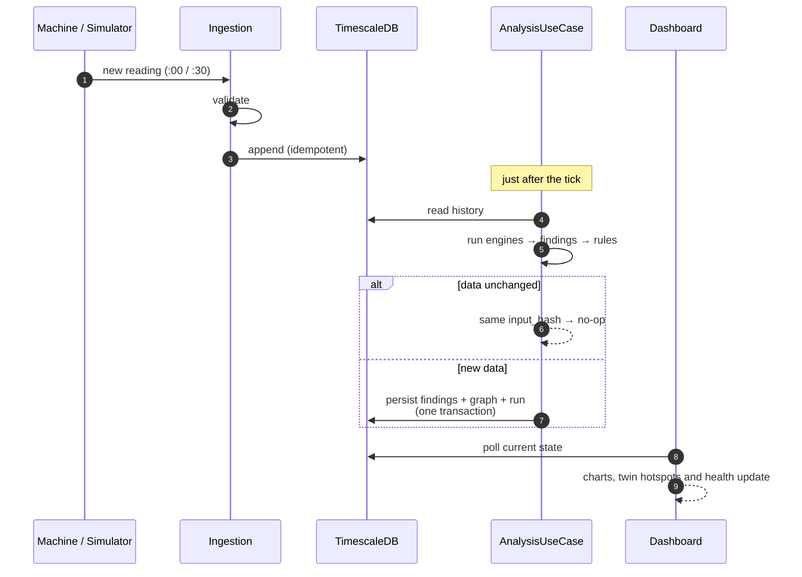
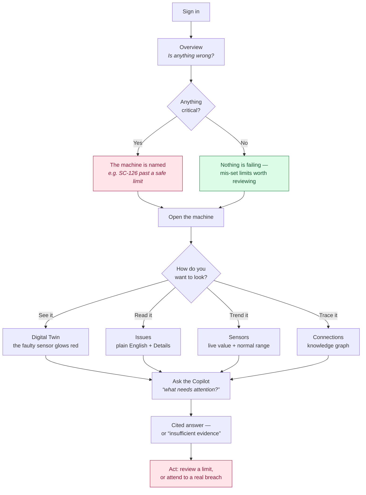
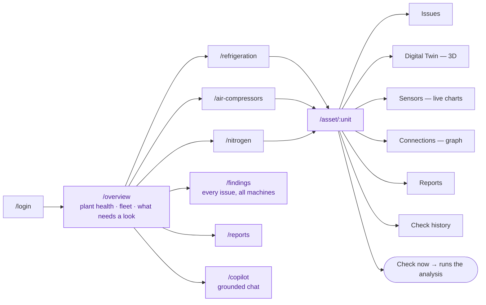

# SenseMinds 360 — Industrial Intelligence Platform

An explainable, grounded industrial-intelligence platform for pharmaceutical
refrigeration and utility equipment (screw compressors, air and nitrogen plants).
It turns raw sensor history into **deterministic engineering findings**, a
**knowledge graph**, **rule-based diagnoses**, **learned hypotheses and
forecasts**, and finally a **grounded, citation-enforced LLM** that explains all
of it in plain language — without inventing anything.

Built and validated on **6 real machines** at Laurus Labs (Visakhapatnam):
`SC-126`, `SC-114`, `SC-104`, `COM-102`, `COM-110`, `COM103 & NP102`
(≈ **2.86 million sensor readings**).

---

## The core idea

Most "AI for maintenance" tools jump straight to black-box ML. SenseMinds inverts
that: **deterministic engineering first, learning second, language last.** Every
layer is explainable, reproducible, and can be traced back to the exact data and
rule that produced it. The LLM is a *narrator over grounded evidence*, never a
source of truth — and it is architecturally prevented from hallucinating.



Solid = deterministic and certain. Dashed = learned, advisory, never confirmed.
The LLM sits at the *end* — it explains, it never decides.

Design is captured in **19 Architecture Decision Records** under
[`docs/architecture/`](docs/architecture/) (ADR-001 … ADR-019).

---

## How it works

### System architecture



**Everything in step 3 commits or rolls back together** — findings, graph, report,
run record. A re-run of the same data is a no-op (idempotent on `input_hash`).

### The live loop — what happens every 30 seconds



### What a user actually does



### UI map



---

## What it can do today (all validated end-to-end from Docker Compose)

1. **Ingest** sensor data continuously into TimescaleDB (CSV bootstrap now; live
   OPC-UA / MQTT is a future adapter behind the same interface).
2. **Automatically run** the full analysis pipeline for an asset.
3. **Persist** every output atomically — findings, knowledge graph, reports,
   engine-run audit, artifacts — all commit or all roll back.
4. **Answer natural-language questions** through the grounded LLM (Groq
   Llama-3.3-70B, or an offline deterministic stub) — every engineering claim
   cites a real finding id; unsupported claims are dropped.
5. **Expose REST APIs** (JWT auth + roles).
6. **Serve dashboard data** (assets, findings, diagnoses, forecasts, KG subgraph,
   reports).
7. **Generate reports** (daily asset-health, etc.).
8. **Run entirely from `docker compose up`.**

---

## Project status — stage completion

> Honest, component-level percentages. "Frozen" = complete, reviewed, and not to
> be changed unless a defect is found.

| Layer / component | Status | % |
|---|---|---|
| **Architecture & ADRs** (001–019) | Complete, accepted | **100%** 🔒 |
| **Deterministic engines** (7) | Complete, parity-tested vs Phase-1 | **100%** 🔒 |
| **Findings layer** (immutable contract) | Complete | **100%** 🔒 |
| **Knowledge Graph** (+ persistence, restart-durable) | Complete | **100%** 🔒 |
| **Rule Engine** (diagnoses, auditable reasoning) | Complete | **100%** 🔒 |
| **Persistence** (TimescaleDB + repos + UnitOfWork) | Complete, byte-parity proven | **100%** 🔒 |
| **Analysis orchestration** (atomic, idempotent, concurrent-safe) | Complete | **100%** 🔒 |
| **Pattern Learning** (unsupervised novelty / regimes) | Implemented; not yet wired into live pipeline | **90%** |
| **Forecasting** (short-horizon, backtested) | Implemented; not yet wired into live pipeline | **90%** |
| **LLM communication layer** (ADR-018, grounded + cited) | Complete; live Groq validated | **100%** |
| **REST API** (assets/findings/diagnoses/reports/graph/analyze/llm) | Core complete | **90%** |
| **Auth** (JWT + roles + seed) | Working; no OIDC/refresh/user-mgmt UI | **80%** |
| **Ingestion worker** (idempotent analysis cycles) | Batch cycles work; live streaming deferred | **85%** |
| **Docker / deployment** (compose stack) | Runs end-to-end; needs dep pinning + hardening | **90%** |
| **Monitoring / logging** (JSON logs, `/metrics`, `/ready`) | Basic done; no OpenTelemetry tracing yet | **60%** |
| **Dashboard** (React SPA — overview, fleets, asset detail, findings, reports, Copilot) | Built, runs in the stack | **95%** |
| **Digital Twin** (3D machine view, live sensor hotspots) | Built for all 6 machines | **90%** |
| **Live ingestion** (30s simulator + REST push endpoint) | Working; OPC-UA/MQTT adapter still to come | **80%** |
| **Phase C — supervised learning** | Deferred (needs labeled maintenance events) | **0%** |
| **Testing** | 226 tests (unit + parity + integration) | **90%** |

**Overall platform: ~90% of a production-style MVP.**
The intelligence core, serving layer and dashboard are done; the main remaining
work is wiring pattern-learning/forecasting into the live run, dependency
pinning, and (future) streaming + supervised learning.

### Dashboard

A light, warm React SPA (`frontend/`) — deliberately **not** the usual dark-navy
"AI" look. The palette is **computationally validated**, not eyeballed: every hue
passes a lightness band, chroma floor, contrast (≥3:1 on the light surface) and
colour-vision-deficiency separation check (adjacent ΔE2000 ≥ 12 under protan /
deutan / tritan simulation).

- **Categorical** (chart series, fixed order): `#7C3AED` violet · `#0F9D8F` teal ·
  `#C026D3` fuchsia · `#4D7C0F` olive · `#0284C7` cyan
- **Status** (reserved, always with an icon + label — never colour alone):
  `#15803D` healthy · `#57534E` info · `#B45309` watch · `#BE123C` critical

Pages: **Overview** (plant health, fleet, what needs a look) · **Refrigeration /
Air Compressors / Nitrogen Plant** fleets · **Asset detail** · **Findings** ·
**Reports** · **Plant Copilot** (grounded chat — every claim shows its cited
finding ids, and gaps appear as *insufficient evidence*).

Findings are written in **plain English** ("The limit set for this sensor doesn't
match how the machine actually runs — this is not a fault"), with the precise
engineering wording one click away.

**Asset detail** carries three views of the same machine:

| Tab | What it shows |
|---|---|
| **Digital Twin** | A rotatable 3D view of the machine, assembled from its *real* subsystems. Every sensor is a hotspot at its physical location, coloured by state and glowing/pulsing when in alarm. Three separate blocks: the machine · overall state · sensor readings. |
| **Sensors** | Live value + trend chart per sensor, with the normal operating range shaded. Refreshes on the 30s cadence. |
| **Connections** | The knowledge graph for that asset. |

The twin is generated geometry (bevelled machined parts, bolted flanges, gauges,
guards, dished pressure vessels, reflective metal) — **a representative view of the
equipment, not a CAD model of the physical unit**, and it says so on screen.
three.js is lazy-loaded, so it costs nothing on any other page.

It shows only what the platform actually computes — **no invented failure
probability or RUL**, because the backend does not produce them yet.

### Live data

Two ways to feed the platform:

1. **`POST /api/v1/readings`** — the production path. Any edge gateway, historian
   export or OPC-UA/MQTT bridge posts readings; they go through the same
   validation and sink a CSV bootstrap uses, so nothing downstream knows the
   difference.
2. **Simulator** (`--profile sim`) — generates realistic **30-second** data for all
   6 machines from their real statistical profiles, appends to a growing CSV, tails
   it just after each tick, ingests and re-analyses. It also ramps SC-126's
   discharge pressure past its **280 bar protection setpoint**, so you can watch the
   platform detect a genuine fault end-to-end: `THRESHOLD_CRITICAL` → health cascade
   → dashboard turns red → Copilot explains it, with citations.

### Plant Copilot

A real assistant, not a search box — but one that **cannot make things up**.

- **Grounded**: every engineering statement must cite a `finding_id` from the retrieved
  evidence. Uncited claims are mechanically **dropped** by a validator; the model is not
  trusted to police itself.
- **Conversational**: it classifies each message as *chat* or *engineering*. A greeting
  gets a one-line reply with **zero claims** (no evidence dump); a real question gets a
  grounded, cited answer.
- **Remembers**: recent turns are sent with each message, so follow-ups like *"what do you
  mean?"* resolve. Memory shapes **only the wording** — evidence is re-retrieved fresh every
  turn, so history can never change what is true (ADR-018 §7).
- **Honest about gaps**: if the evidence doesn't cover the question, it says
  *insufficient evidence* rather than guessing.

Set `SENSEMINDS_GROQ_API_KEY` to enable it. **Without a key it falls back to a
deterministic stub** — which exists to run the grounding tests offline, not to hold a
conversation — and the UI shows an explicit **"offline mode"** banner rather than
pretending.

### Written for operators, not architects

The UI speaks plain English. A finding reads *"The limit set for this sensor doesn't match
how the machine actually runs. The limit probably needs reviewing — this is not a fault."*
The precise engineering wording is one click away under **Details**.

The dashboard is also careful not to over-reassure: the "mis-set limits are not faults"
nuance (true for 5 of the 6 machines) is **suppressed the moment any machine is genuinely
in alarm**, and the offending machine is named instead.

### Test suite
- **226 passing** with a database (unit + parity + integration).
- **195 passing / 31 skipped** offline (integration tests skip gracefully with no DB).
- `ruff` clean. Deterministic engine outputs are **byte-identical** whether data
  is loaded from CSV or reconstructed from TimescaleDB (proven for all 6 machines).

---

## Key engineering findings (what the platform actually concluded)

The platform is honest — it does **not** invent problems:

- **SC-126 is a healthy, stable baseload machine.** Its "threshold" findings are
  **mis-specified operating limits (a configuration/data issue), not equipment
  faults** — the supplied limits don't match how the machine actually runs. The
  grounded LLM correctly reports this as *"mis-set operating limits rather than
  faults"* and refuses to escalate it into a health problem.
- Several sensors show **drift between the first and second half of history** and
  **flatlined (repeated-identical) readings** — data-quality / reliability
  signals, surfaced as findings, not alarms.
- With no forecast evidence present, the LLM **refuses to claim** any limit is
  "being approached soon" and lists that gap under *insufficient evidence* — the
  anti-hallucination design working as intended.

---

## Run it locally

```bash
cd deployment
cp .env.example .env          # set passwords/secrets; leave SM_DATA/SM_DATASETS as-is locally
docker compose up -d --build  # postgres+timescale, migrate, api, dashboard

# feed it data — pick ONE:
docker compose --profile batch up -d worker      # real historical CSVs
docker compose --profile sim   up -d simulator   # live 30-second simulated feed
```

* **Dashboard → http://localhost:3000** (sign in with the admin credentials from `.env`)
* API → http://localhost:8000 · docs at `/docs` · health at `/health`

### Restarting after a reboot

```bash
cd deployment && ./start.sh          # sim (default) | batch | none
```

Idempotent and safe: it rebuilds only what's missing and the simulator **resumes**
rather than reseeding. Verified by destroying every container — 675,367 readings /
2,702 findings came back untouched.

> **All state lives in `$SM_DATA`** (database, artifacts, live CSVs) as bind mounts —
> *not* Docker named volumes. Named volumes sit on ephemeral disk and are lost when the
> host is recycled; this survives.

---

## Deploying to GCP (or any VM)

The whole platform is one Docker Compose stack, so a single VM is all you need.

### 1. Create the VM

```bash
gcloud compute instances create senseminds \
  --machine-type=e2-standard-4 \           # 4 vCPU / 16 GB — analysis is CPU-bound
  --image-family=ubuntu-2404-lts --image-project=ubuntu-os-cloud \
  --boot-disk-size=100GB --boot-disk-type=pd-balanced \
  --tags=senseminds
```

Open the port (do this **only** if you are not putting a proxy in front):

```bash
gcloud compute firewall-rules create senseminds-web \
  --allow=tcp:80,tcp:443 --target-tags=senseminds
```

### 2. Install Docker

```bash
gcloud compute ssh senseminds
curl -fsSL https://get.docker.com | sudo sh
sudo usermod -aG docker $USER && exit      # log back in for the group to apply
```

### 3. Get the code and the machine data

```bash
sudo mkdir -p /opt && cd /opt
git clone https://github.com/Sreecharan03/Industrial-Predective-Maintanance.git senseminds
sudo mkdir -p /opt/senseminds-data /opt/senseminds-datasets
sudo chown -R $USER /opt/senseminds*
```

The repo does **not** contain the sensor data. Copy the processed CSVs up (~31 MB —
only `Datasets/processed/*.csv` is needed):

```bash
# from your machine
gcloud compute scp Datasets/processed/*.csv senseminds:/opt/senseminds-datasets/processed/
```

### 4. Configure

```bash
cd /opt/senseminds/deployment
cp .env.example .env
nano .env
```

Set at minimum:

```env
SM_DATA=/opt/senseminds-data              # persistent disk — DB lives here
SM_DATASETS=/opt/senseminds-datasets      # the processed CSVs

POSTGRES_PASSWORD=<long random>
SENSEMINDS_JWT_SECRET=<64+ random chars>   # openssl rand -hex 32
SENSEMINDS_DEFAULT_ADMIN_PASSWORD=<strong>
SENSEMINDS_GROQ_API_KEY=<your groq key>    # empty ⇒ offline stub, still works
```

> ⚠️ The admin user is seeded **once**, on the first start against an empty database.
> Set the password *before* you bring the stack up.

### 5. Launch

```bash
docker compose up -d --build
docker compose --profile sim up -d simulator     # or --profile batch up -d worker
docker compose ps
curl localhost:8000/health
```

Everything has `restart: unless-stopped`, so the stack comes back by itself after a
VM reboot.

### 6. Put TLS in front (recommended)

Don't expose 3000/8000 directly. Point a domain at the VM and terminate TLS with Caddy:

```bash
# /opt/senseminds/deployment/Caddyfile
senseminds.example.com {
    reverse_proxy dashboard:80
}
```

```bash
docker run -d --name caddy --restart unless-stopped \
  --network deployment_smnet -p 80:80 -p 443:443 \
  -v /opt/senseminds/deployment/Caddyfile:/etc/caddy/Caddyfile \
  -v /opt/senseminds-data/caddy:/data caddy
```

Caddy fetches and renews the certificate automatically. Then remove the
`ports:` mappings for `api` and `dashboard` so only Caddy is public.

### 7. Back it up

Everything that matters is in Postgres:

```bash
docker compose exec -T postgres pg_dump -U senseminds senseminds | gzip \
  > /opt/backups/senseminds-$(date +%F).sql.gz
```

Put that in a cron job and push to a GCS bucket. `$SM_DATA/live` (the CSVs) is a
second recovery source — ingestion is watermark-driven, so restoring the CSVs and
restarting re-ingests anything the database is missing.

### Sizing notes
* **e2-standard-4** comfortably runs 6 machines with the 30-second feed.
* The analysis is **CPU-bound** (pandas); scale vCPU before RAM.
* 100 GB disk holds years of 30-second history for 6 machines (TimescaleDB
  compresses chunks older than 30 days).

### Later, if you outgrow one VM
* Swap the `postgres` service for **Cloud SQL** (change `SENSEMINDS_DATABASE_URL` — nothing else).
* Run `api` on **Cloud Run**, keep the `worker`/`simulator` on a VM.
* The three schemas (`sensor_history`, `knowledge`, `application`) were built to be
  separable into independent databases without touching application code.

---

## Repository layout

```
senseminds/
├── domain/            immutable domain models, enums, value objects
├── catalog/           asset/sensor/threshold reference data
├── ingestion/         TimeSeriesSource + CSV/DB adapters, ReadingSink, validation
├── engines/           7 deterministic analytics engines
├── findings/          immutable Finding contract + assembler
├── knowledge_graph/   graph model, repository, idempotent projector
├── rules/             rule definitions + forward-chaining evaluator
├── pattern_learning/  unsupervised novelty / regime discovery (Phase B)
├── forecasting/       pluggable, backtested short-horizon forecasting (Phase B)
├── llm/               grounded communication layer (ADR-018): retrieval, prompt,
│                      citation validator, stub + Groq adapters
├── repositories/      aggregate-root repository ports + models
├── application/       analysis pipeline + AnalysisUseCase (atomic orchestration)
├── infrastructure/    DB engine, migrations, Postgres repositories, graph store,
│                      artifact store, logging
├── api/               FastAPI app, routers, JWT auth, request logging
└── workers/           continuous analysis worker
├── simulation/        live 30s machine simulator (testing / demo)
├── workers/           continuous analysis worker
frontend/              React + Vite + Tailwind dashboard (validated light palette)
  └── src/components/twin/   3D digital twin (three.js, lazy-loaded)
deployment/            Dockerfile, docker-compose.yml, .env.example
docs/architecture/     ADR-001 … ADR-019
tests/                 226 tests (unit + parity + integration)
```

---

## Next steps (roadmap)

**MVP-completing (near term)**
- **Wire Pattern Learning + Forecasting into the live `AnalysisUseCase`** so
  novelty/regime/forecast findings persist alongside the deterministic ones.
- **Pin dependencies** (lockfile) — the Docker image currently installs unpinned
  newer numpy/scipy/pandas; pin them so deterministic outputs never drift.
- **API hardening** — pagination, rate limiting, refresh tokens / OIDC.

**Production hardening (recommended)**
- OpenTelemetry tracing + per-engine metrics; alerting.
- Artifact/KG retention policies; backup & restore (DR).
- Streaming ingestion adapter (OPC-UA / MQTT / historian) behind the existing
  `TimeSeriesSource` / `ReadingSink` seam.

**Future**
- **Phase C — supervised learning** (failure prediction / RUL) once labeled
  maintenance events accumulate. Human feedback on learned findings is already
  the label-bootstrap store.

---

## Principles (kept throughout)

- **Deterministic facts vs. learned hypotheses** are separated at every layer.
- **Everything is explainable, reproducible, and traceable** to its evidence.
- **The LLM never computes or invents** — grounded, cited, register-aware, and
  free to say "insufficient evidence."
- **Nothing frozen is changed** without a genuine defect.

_Architecture and rationale: see [`docs/architecture/`](docs/architecture/)._
