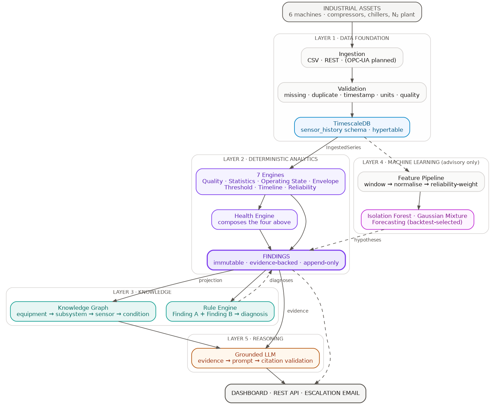
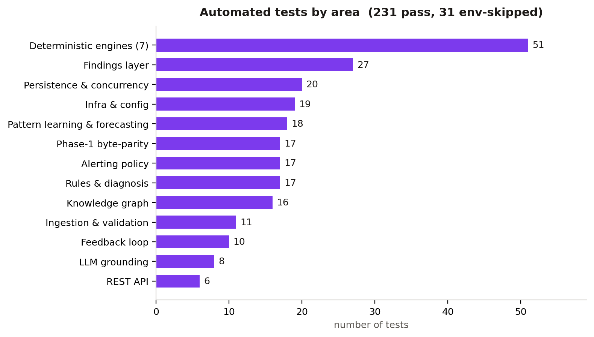

# SenseMinds 360 — Codebase Review

**For technical review of the complete codebase.** A concise map of what exists,
how it is structured, how it is tested, and what is deployed. Deeper detail lives
in the companion documents linked at the end.

*22 July 2026 · 231 automated tests passing · deployed and live on GCP*

---

## 1. What it is

A predictive-maintenance platform for six utility machines at Laurus Labs. It
turns raw sensor history into deterministic engineering facts, a knowledge graph,
rule-based diagnoses, machine-learning hypotheses, escalation email, and a
grounded LLM that explains everything with cited evidence.

**Design rule the whole codebase obeys:** deterministic facts are authoritative;
machine learning is strictly additive and advisory. Remove the ML layer and
nothing deterministic changes.

---

## 2. Architecture at a glance

Data flows top to bottom: validated readings → deterministic engines → immutable
**Findings** → knowledge graph → rule diagnoses → ML enrichment → grounded LLM →
API/dashboard. Full walkthrough with one reading traced end-to-end:
[TECHNICAL-WALKTHROUGH.md](TECHNICAL-WALKTHROUGH.md).

---

## 3. Codebase structure

One modular monolith, strict internal boundaries (`senseminds/`):

| Package | Responsibility |
|---|---|
| `domain/` | Immutable models, enums, value objects |
| `ingestion/` | Validation, `TimeSeriesSource`, CSV/DB adapters, `ReadingSink` |
| `engines/` | The 7 deterministic analytics engines |
| `findings/` | Immutable `Finding` contract + assembler |
| `rules/` | Rule definitions + forward-chaining evaluator (diagnoses) |
| `knowledge_graph/` | Graph model, projector, feedback projector |
| `pattern_learning/` | Unsupervised novelty / regimes + engineer feedback store |
| `forecasting/` | Backtest-selected short-horizon forecasting |
| `llm/` | Grounded communication: retrieval, prompt, citation validator |
| `alerting/` | Escalation policy, SMTP mailer, outbox dispatcher |
| `application/` | `AnalysisUseCase` — atomic orchestration |
| `repositories/` | Aggregate-root ports + models |
| `infrastructure/` | DB engine, migrations, Postgres repos, artifact store, logging |
| `api/` | FastAPI app, routers, JWT auth |
| `workers/` | Continuous analysis worker |
| `frontend/` | React + Vite + Tailwind dashboard |

**Boundaries that make it reviewable and extensible:** business logic depends on
*ports* (interfaces), not concretes — `ArtifactStore`, `KnowledgeGraphRepository`,
`TimeSeriesSource`, `LanguageModel`. Each has an in-memory implementation for
tests and a production one, so swapping storage or the graph engine later is one
class, not a rewrite.

---

## 4. Testing & validation

**231 automated tests pass** (31 skipped only when a live database isn't present),
plus live end-to-end suites and a tested disaster-recovery restore. Zero `ruff`
lint findings.

### 4.1 Kinds of validation used

| Kind | What it proves | Where |
|---|---|---|
| **Unit tests** | Each engine / component behaves per spec | 51 engine + per-module tests |
| **Byte-parity tests** | Refactored engines produce output **byte-identical** to the original Phase-1 analysis | 17 `test_parity_*` |
| **Persistence parity** | Data round-trips CSV → DB → reconstruction identically | `test_db_parity`, `test_application_persistence` |
| **Idempotency & concurrency** | Re-running an input is a no-op; 5 concurrent analyses produce one result | `test_analysis_concurrency`, `test_kg_idempotency` |
| **Policy edge cases** | Alerting lifecycle (17) and feedback loop (10) pinned against every corner case | `test_alert_policy`, `test_feedback_loop` |
| **Live end-to-end** | 28 real cases against the running API + Postgres (auth, validation, append-only triggers, KG survival) | feedback E2E suite |
| **Tested restore** | A backup actually restores into a throwaway DB with data + triggers intact | `validate-restore.sh` — **PASSED** |
| **Live deployment checks** | CORS, metrics, a real escalation email delivered from the server | verified on the VM |

### 4.2 Notable things the tests caught (and now guard)

- **Findings explosion** — un-changed conditions were re-recorded every cycle
  (4,006 rows for 25 conditions). Fixed with a material-change filter; pinned by
  `test_finding_delta`.
- **Verdict-erasure regression** — engineer verdicts would have been silently
  wiped by the next ML re-projection. Fixed by storing them on their own graph
  node; pinned by `test_validation_survives_a_pattern_reprojection`.
- **Backup that wouldn't restore** — a floating Postgres image tag drifted the
  TimescaleDB version and broke logical restore. Caught only by *testing* the
  restore; fixed by pinning the image by digest.

### 4.3 Reproducibility discipline

- Python dependencies pinned in `requirements.lock` (the image builds from it, not
  open ranges) — protects byte-identical numerical output.
- The Postgres/TimescaleDB image pinned by digest.
- Every engine is a pure function; every finding carries provenance (engine,
  version, input hash, timestamp).

---

## 5. Deployment status

**Live on GCP** (Deployment Strategy v1, single plant):

| Item | Status |
|---|---|
| Compute | GCE VM, Dockerised stack |
| State | Postgres + artifacts on a **persistent disk** (survives VM deletion) |
| Data | All 6 machines bootstrapped (~2.6M readings), analysed |
| API | `http://35.254.19.129:8000` · docs at `/docs` · health at `/ready` |
| Backups | Nightly `pg_dump` + disk snapshots, tested restore |
| Escalation email | Verified — a real alert delivered from the server |

Durability, backup, and recovery policy: [DATA-GOVERNANCE.md](DATA-GOVERNANCE.md).
Deployment architecture and rationale: [DEPLOYMENT-STRATEGY-V1.md](DEPLOYMENT-STRATEGY-V1.md).

---

## 6. Honest scope

**Complete and running:** all 7 engines, findings, knowledge graph, rules,
pattern learning, forecasting, grounded LLM, alerting, the feedback loop, the
dashboard, and the deployment.

**Not built, by design:**
- **Phase C supervised failure prediction / RUL** — blocked on labelled breakdown
  history the plant hasn't provided. The feedback loop is already capturing the
  labels that will unlock it.
- **OPC-UA / Modbus ingestion** — data currently arrives via CSV/REST.
- **Auth hardening** (rotating dev secrets, refresh tokens, user management) and
  HTTPS lock-down — deferred for v1, required before external exposure.

---

## 7. Companion documents

| Document | Contents |
|---|---|
| [TECHNICAL-WALKTHROUGH.md](TECHNICAL-WALKTHROUGH.md) | Architecture, one reading traced end-to-end, six scenario dry runs, edge cases |
| [API-REFERENCE.md](API-REFERENCE.md) | Every endpoint, for the frontend engineer |
| [DEPLOYMENT-STRATEGY-V1.md](DEPLOYMENT-STRATEGY-V1.md) | GCP deployment, single plant |
| [DATA-GOVERNANCE.md](DATA-GOVERNANCE.md) | Durability, consistency, tested recovery |
| [`docs/architecture/`](architecture/) | ADR-001 … ADR-019 — every decision and its rejected alternatives |
