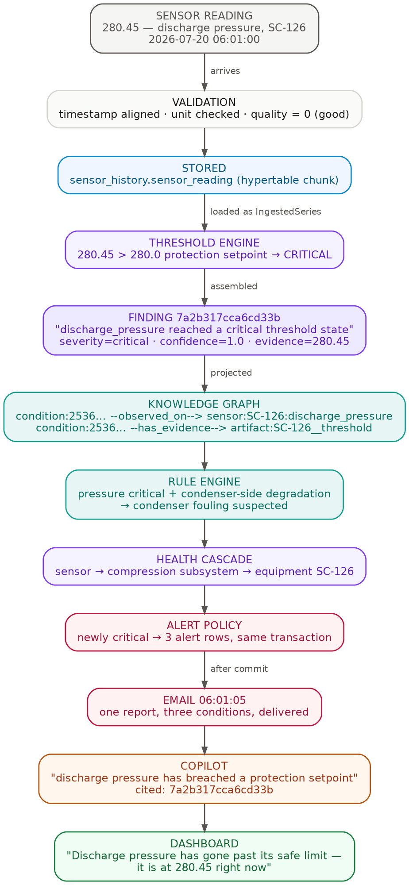
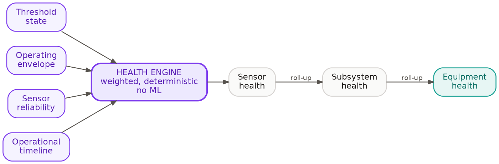
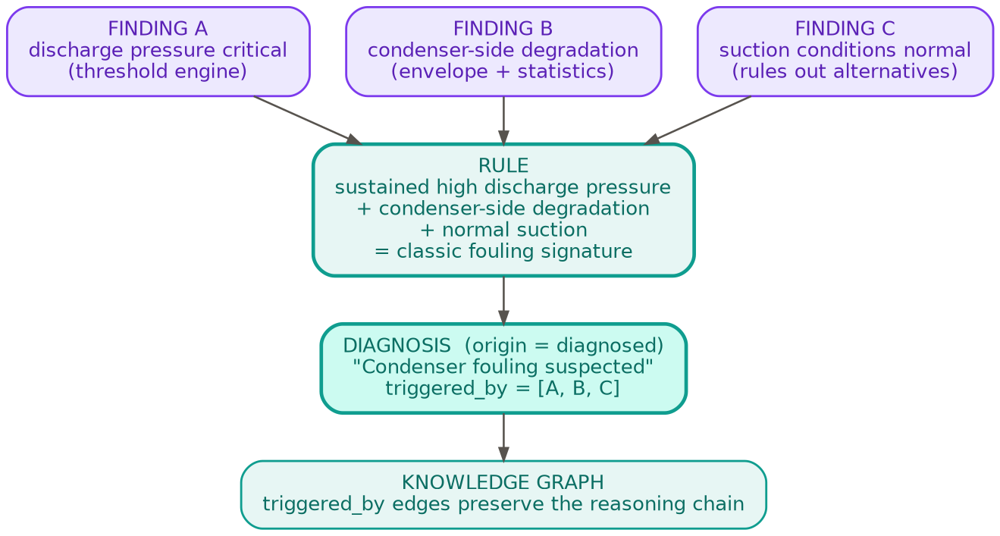
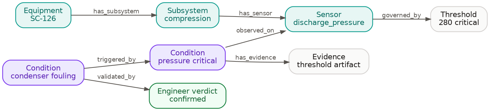
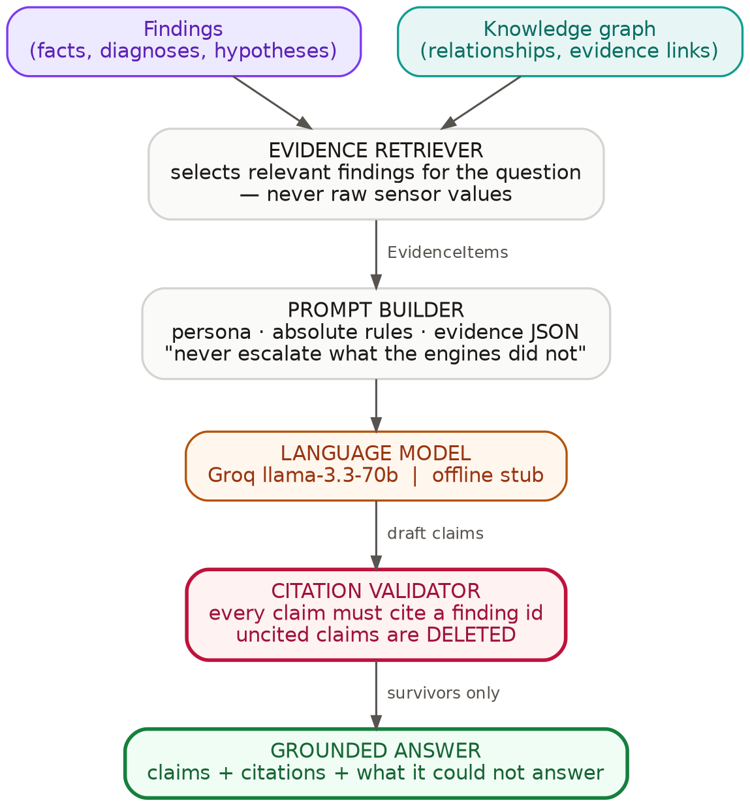

# SenseMinds 360 — Technical Walkthrough

**Architecture, data flow, and scenario dry runs**

A predictive-maintenance platform for six utility machines at Laurus Labs. This
document explains how it is built, follows a single sensor reading through every
layer of it, and shows the system handling six real scenarios.

Every figure, query result and JSON payload was captured from the running stack.
Nothing is illustrative.

*Captured 20 July 2026 · 6 machines · 231 automated tests passing*

---

# PART I — THE ARCHITECTURE

## 1. The whole system on one page


Read it top to bottom. Sensor data enters at Layer 1, becomes engineering facts
at Layer 2, acquires *meaning* at Layer 3, is enriched by machine learning at
Layer 4, and is explained in natural language at Layer 5.

The single most important thing in that diagram is the **direction of the dashed
arrows**. Machine learning reads from the deterministic layers and writes only
hypotheses back. Nothing downstream treats an ML output as authoritative.

> **The governing rule of the architecture:** deterministic facts are
> authoritative; machine learning is strictly additive. Delete the entire ML
> layer and nothing deterministic changes — the platform keeps working, it just
> stops noticing things nobody wrote a rule for.

### Why this shape

| Decision | Reason |
|---|---|
| Rules before ML | A supervised model trained without labelled failures cannot be validated, so its false-positive rate is unmeasurable. An unmeasurable alarm trains operators to ignore the system. |
| ML kept advisory | Anomaly detection catches the unanticipated, but cannot explain itself. Ranking it beneath deterministic rules keeps the benefit without inheriting the unreliability. |
| A knowledge graph in the middle | Relationships (which sensor belongs to which subsystem, which findings triggered which diagnosis) are the questions relational tables answer worst. §7 |
| LLM last, and constrained | Explanation is a presentation concern. The model narrates evidence; it never computes or decides. §9 |

## 2. The domain object everything is built from: a Finding

Before any layer makes sense, one object has to: **a Finding is the platform's
immutable engineering claim.** Every screen, alert, diagnosis and LLM sentence in
the system ultimately points at one.

A Finding is:

- **an observation, never a measurement.** "Discharge pressure reached a critical
  threshold state" is a finding; `280.45` is the evidence beneath it.
- **immutable and append-only**, enforced by a database trigger that rejects
  UPDATE and DELETE. The record of what the platform believed, and when, cannot
  be rewritten.
- **required to carry evidence.** Construction without at least one piece of
  evidence is rejected by the type system.
- **carrying no workflow state and no priority.** Those belong to the systems
  that consume findings, not to the fact itself.

```json
{
  "finding_id": "7a2b317cca6cd33b",
  "identity_key": "253615721127ab11",
  "finding_type": "threshold_critical",
  "origin": "derived",
  "summary": "discharge_pressure reached a critical threshold state",
  "detail": "Latest reading 280.45 breached a protection setpoint.",
  "target_key": "discharge_pressure",
  "equipment_key": "SC-126",
  "subsystem_key": "compression",
  "severity": "critical",
  "confidence": { "value": 1.0,
                  "rationale": "100.0% coverage (9758 of 9758 readings evaluated)." },
  "evidence": [ { "artifact_id": "SC-126__threshold",
                  "description": "current state critical",
                  "observed_value": 280.45 } ],
  "provenance": { "engine": "findings", "engine_version": "0.1.0",
                  "input_hash": "d6cb92c32cf6af9e",
                  "produced_at": "2026-07-20T06:01:03.495310Z" }
}
```

### Two identifiers, doing different jobs

This distinction runs through the entire system and is worth pausing on:

| Field | Meaning | Changes when |
|---|---|---|
| `finding_id` | **This observation.** `hash(identity_key, input_hash)` | The data changes |
| `identity_key` | **This condition.** Stable across observations | Never, for the same condition |

A pressure breach observed at 06:01 and again at 06:02 produces two
`finding_id`s and one `identity_key`. Alerts, engineer verdicts and the knowledge
graph all key on `identity_key` — because they are about the *condition*, not
about one 30-second snapshot of it.

### Three origins, three levels of trust

| Origin | Produced by | Treated as |
|---|---|---|
| `derived` | An engine, deterministically | **Fact** |
| `diagnosed` | The rule engine, from multiple findings | **Reasoned conclusion** |
| `learned` | An ML model | **Hypothesis — advisory only** |

The interface, the alerting policy and the LLM each respect this ranking. Only
`derived` and `diagnosed` findings at critical severity can raise an alarm.

---

# PART II — THE LIFE OF ONE SENSOR READING

## 3. From 280.45 to a sentence on a screen

This is the whole platform in one trace. A real reading, real identifiers, real
timestamps — the same breach that appears in the alert table in §12.



**Step by step:**

1. **06:01:00 — the reading arrives.** `discharge_pressure = 280.45` on SC-126.

2. **Validation.** Timestamp aligned to the 30-second grid, engineering unit
   confirmed against the sensor catalog, quality flag set to 0 (good). A reading
   that failed here would be stored but marked, never silently dropped.

3. **Stored.** Written to `sensor_history.sensor_reading`, a TimescaleDB
   hypertable. The machine's ingest watermark advances to `06:01:00`.

4. **Loaded as an `IngestedSeries`.** Layer 2 never issues SQL — it receives a
   typed object containing the validated frame plus the asset manifest.

5. **The threshold engine.** `280.45` exceeds SC-126's protection setpoint of
   `280.0` → state `CRITICAL`. Six other engines run over the same series in
   parallel.

6. **A Finding is assembled** — `7a2b317cca6cd33b`, severity critical, confidence
   1.0 with the rationale that 9,758 of 9,758 readings were evaluated, evidence
   pointing at the threshold engine's artifact.

7. **Projected into the knowledge graph.** Two edges are written:
   ```
   condition:253615721127ab11 --observed_on--> sensor:SC-126:discharge_pressure
   condition:253615721127ab11 --has_evidence--> artifact:SC-126__threshold
   ```
   Read as a sentence: *this condition was observed on SC-126's discharge
   pressure sensor, and the evidence for it is the threshold engine's output.*

8. **The rule engine looks for combinations.** Sustained high discharge pressure
   together with condenser-side degradation and normal suction conditions matches
   a stored fouling signature → a `diagnosed` finding, "condenser fouling
   suspected", carrying `triggered_by` links to every finding that caused it.

9. **Health cascades up the hierarchy.** The sensor-level problem reduces
   compression-subsystem health, which reduces equipment health. These are two
   further findings — not separate faults, but the same breach expressed at
   higher levels of the asset.

10. **The alert policy runs inside the same transaction.** Three conditions are
    newly critical, so three alert rows are written *with* the findings.

11. **06:01:05 — the email.** After the transaction commits, the dispatcher
    groups all three into **one** report and delivers it. Two seconds from breach
    to inbox.

12. **The Copilot can now answer questions about it**, citing
    `7a2b317cca6cd33b` for anything it says.

13. **The dashboard shows it in plain English:** *"Discharge pressure has gone
    past its safe limit — it is at 280.45 right now."*

Everything after step 6 is downstream of the Finding. That is why §2 introduced
it first.

---

# PART III — THE LAYERS IN DETAIL

## 4. Layer 1 — Data foundation

Readings are validated before storage: missing values, duplicates, timestamp
correction, unit conversion, sensor quality.

```
          time          |  unit  |     sensor_key     | value  | quality |  source
------------------------+--------+--------------------+--------+---------+----------
 2026-07-20 06:02:00+00 | SC-126 | suction_pressure   |  16.39 |       0 | live_csv
 2026-07-20 06:02:00+00 | SC-126 | discharge_pressure | 280.05 |       0 | live_csv
 2026-07-20 06:02:00+00 | SC-126 | oil_pressure       | 185.49 |       0 | live_csv
```

A **sensor catalog** maps each machine's raw column headings to canonical keys.
This table exists for a specific reason: thresholds are configured against the
plant's own column names, while the platform reasons in normalised keys. Without
it, a renamed CSV header would silently detach a sensor from its limits.

```
  unit  |     sensor_key     |   source_column    | ordinal
--------+--------------------+--------------------+---------
 SC-126 | suction_pressure   | Suction Pressure   |       0
 SC-126 | discharge_pressure | Discharge Pressure |       1
 SC-126 | oil_pressure       | Oil Pressure       |       2
```

A **watermark** per machine records the last ingested timestamp, so each cycle
processes only new data rather than rescanning history.

**Handoff:** `DbTimeSeriesSource` returns an `IngestedSeries`. Layer 2 is
database-unaware.

## 5. Layer 2 — Deterministic analytics

Seven engines run as pure functions. Identical input always produces
byte-identical output, which is what makes every conclusion auditable and
reproducible.

| Engine | Question it answers |
|---|---|
| Quality | Is this reading trustworthy enough to reason from? |
| Statistics | What is normal for this sensor on this machine? |
| Operating state | Running, idle, or stopped? |
| Operating envelope | Inside its designed envelope? |
| Threshold | Has a value crossed a specification or protection setpoint? |
| Operational timeline | How has behaviour evolved over the period? |
| Reliability | Is the sensor itself drifting, stuck, or degrading? |

### 5.1 How health is computed

Health is not an eighth engine measuring something new. It is a **composition**
of what the others already established, which is why it is deterministic and
explainable rather than a model output.



Two properties follow from this design:

- **It is explainable by construction.** A reduced health score can always be
  decomposed into the specific threshold states, envelope excursions and
  reliability problems that caused it. The platform reports these directly:
  *"What is pulling it down: oil system, evaporator, compression."*
- **It does not depend on ML.** A health score computed by a model would be
  opaque and label-dependent — unsuitable for a number that drives maintenance
  decisions.

Health rolls up the asset hierarchy: sensor → subsystem → equipment. This is why
a single pressure breach produces three findings rather than one.

## 6. The rule engine — turning findings into diagnoses

A threshold engine can tell you that discharge pressure is critical. It cannot
tell you *why*. That requires combining several independent findings, which is
what the rule engine does.



A rule is a deterministic, explainable statement of engineering knowledge:

> **IF** sustained high discharge pressure breach
> **AND** condenser-side degradation
> **AND** suction conditions normal
> **THEN** condenser fouling suspected

The output is a Finding like any other, but with `origin = diagnosed` and one
additional field — `triggered_by`, holding the `identity_key` of every finding
that caused it. This is projected into the graph as `triggered_by` edges, so the
reasoning chain is **stored, not recomputed**: months later it is still possible
to ask why the platform concluded fouling on a particular day, and get the exact
findings it reasoned from.

Three design constraints on rules:

1. **Rules read findings, never raw sensor values.** A rule cannot invent a
   measurement.
2. **A rule may reference a learned hypothesis only as optional, low-weight
   corroboration** — never as a required condition. Otherwise an unvalidated
   model could silently become load-bearing.
3. **Rules are versioned.** A diagnosis records which rule version produced it.

Current volume: **723 diagnosed findings** against 7,663 measured ones.

## 7. Layer 3 — The knowledge graph, and why it exists

The most common question about this layer is why the data is not simply another
relational table. The answer is that the platform's most valuable questions are
about **relationships**, and relationships are what tables answer worst.



Consider the questions an engineer actually asks:

| Question | As a graph | As tables |
|---|---|---|
| What else is affected if this sensor is wrong? | Walk `has_sensor` / `observed_on` | Multi-way joins |
| Why did the platform diagnose fouling? | Follow `triggered_by` | Recursive join over a self-referencing table |
| What evidence supports this condition? | Follow `has_evidence` | Join through an evidence table |
| Which conditions has an engineer confirmed? | Follow `validated_by` | Another join |
| Show everything connected to SC-126 | One traversal | A query per relationship type |

Each of these is *possible* relationally. The difference is that in a graph they
are the same operation — traversal — and adding a new relationship type costs an
edge type rather than a schema migration and a new join path.

**What the graph stores, and what it does not:** it holds equipment, subsystems,
sensors, threshold definitions, conditions, evidence references, discovered
patterns, learned models and engineer validations. It does **not** hold sensor
values. Measurements live in TimescaleDB; the graph holds what they *mean*.

### 7.1 Why PostgreSQL rather than Neo4j

The graph is two tables, `kg_node` and `kg_edge`, behind a repository interface
with two implementations (in-memory for tests, PostgreSQL for production).

A dedicated graph database was rejected at current scale for three reasons, the
third decisive:

1. 3,234 nodes and 3,649 edges are trivially served by indexed Postgres.
2. A second engine means a second operational surface, backup story and failure
   mode.
3. **Cross-database transactions.** A finding and its graph projection must
   commit atomically. Split across two databases, that guarantee is gone — the
   system could hold a finding whose meaning was never recorded.

The repository interface exists precisely so that migrating to Neo4j, when
multi-plant scale justifies it, replaces one class rather than the architecture.

## 8. Layer 4 — Machine learning

Models never see raw readings. A deterministic feature pipeline stands between
the database and every model.


The **reliability weighting** step is the one worth noticing: each sensor's
contribution is scaled by the reliability engine's own verdict on it, so a
drifting or stuck sensor cannot dominate an anomaly score. This is Layer 2
protecting Layer 4 from itself.

Three models run in production:

| Model | Purpose | Emits |
|---|---|---|
| Isolation Forest | "This window is unlike this machine's history" | `novelty_elevated` |
| Gaussian Mixture | Multivariate operating regimes | `operating_regime_discovered` |
| Forecasting (backtest-selected) | Lead time before a limit | `forecast_threshold_approach` |

**Isolation Forest was chosen over an autoencoder** for the first release
because it is inexpensive, has no training instability, suits the modest feature
dimensionality, and — decisively — provides **per-feature attribution**. The
platform can report *which* sensors drove a score:

> *"Mostly down to: adu2 pressure (lower than usual), cooling water pressure
> inlet (higher than usual)."*

An autoencoder returns a reconstruction error that explains nothing.

**Forecasting will not promote a complex model** unless it beats the simple
seasonal-naive baseline by a margin under walk-forward backtesting. The selector
defaults to the baseline; complexity has to earn its place per sensor.

Phase B is **throttled** — it looks for slow trends, so it runs on its own slower
cadence rather than every 30 seconds.

## 9. Layer 5 — Grounded reasoning

The LLM is a **constrained narrator**, not a reasoner. It receives structured
evidence and must cite it. This is the most safety-critical boundary in the
system: it is where a fluent model could invent an engineering claim.



Four mechanisms make the output trustworthy:

1. **The evidence retriever selects findings**, never raw sensor values. The
   model cannot see a number the engines have not already reasoned about.
2. **The prompt carries absolute rules**, including an explicit *never escalate
   what the engines did not* instruction, and each finding's severity — so the
   model cannot infer urgency the deterministic layer never asserted.
3. **The citation validator deletes uncited claims** before the response leaves
   the server. This is enforcement, not instruction.
4. **Claims are categorised** `fact` / `diagnosis` / `hypothesis` / `forecast`,
   so the interface renders an ML hypothesis differently from a measured fact.

A real answer, captured live:

> **Q:** *"What is wrong with this machine right now?"*
>
> **A:** "The machine SC-126 is currently experiencing several issues. The
> discharge pressure has reached a critical threshold state with a reading of
> 281.55, which has breached a protection setpoint (ref: bf9973c17bf65bde). The
> overall health of the equipment is reduced…"
>
> — 8 claims, every one carrying a finding id · model: `groq`

The response also returns an `insufficient` list: questions the evidence could
not answer. That silence is deliberate and is shown to the user rather than
filled in.

---

# PART IV — IMPLEMENTATION

## 10. Data storage

### 10.1 One database, three schemas

A common misreading is that the platform uses several databases. It uses **one
PostgreSQL 16 instance with the TimescaleDB extension**, containing three
logical schemas:

| Schema | Purpose | Tables |
|---|---|---|
| `sensor_history` | Raw measurements, time-series optimised | `sensor_reading`, `unit_sensor`, `ingest_watermark` |
| `knowledge` | The knowledge graph | `kg_node`, `kg_edge` |
| `application` | Findings, alerts, labels, audit | `asset`, `finding`, `alert`, `feedback`, `engine_run`, `report`, `model_registry`, `rule_version`, `app_user`, `role` |

Each store resolves its **own connection URL**, defaulting to a shared one:

```
SENSEMINDS_DATABASE_URL        = postgresql+psycopg://…/senseminds
SENSEMINDS_SENSOR_HISTORY_URL  = (unset → falls back to DATABASE_URL)
SENSEMINDS_KNOWLEDGE_URL       = (unset → falls back to DATABASE_URL)
SENSEMINDS_APPLICATION_URL     = (unset → falls back to DATABASE_URL)
```

Splitting any store onto its own server later is therefore a **configuration
change, not a code change**.

### 10.2 What TimescaleDB buys

`sensor_reading` is a hypertable — Postgres transparently partitions it into
week-long chunks:

```
 hypertable_name |    chunk_name    |      range_start       |       range_end
-----------------+------------------+------------------------+------------------------
 sensor_reading  | _hyper_1_1_chunk | 2026-07-09 00:00:00+00 | 2026-07-16 00:00:00+00
 sensor_reading  | _hyper_1_2_chunk | 2026-07-16 00:00:00+00 | 2026-07-23 00:00:00+00
```

1. **Queries prune by time** — a 6-hour dashboard query touches one chunk, not
   750,827 rows.
2. **Compression after 7 days**, segmented by `(unit, sensor_key)`.
3. **`time_bucket()` downsampling in the database** — the telemetry endpoint
   returns 90 points without moving raw rows into Python.

> Diagnostic note: `pg_stat_user_tables` reports `sensor_reading` as **0 rows**.
> That is expected — rows live in the chunks, not the parent table.

## 11. Transaction and failure boundaries

### 11.1 One transaction across two schemas

A single analysis cycle writes findings, graph nodes and edges, alerts, reports,
model metadata and the run record. **All of it commits or none of it does**,
inside one unit of work holding one session spanning both `application` and
`knowledge`.

The system therefore cannot reach a state where a finding exists but its meaning
was never recorded, or where an alert was decided but its finding was rolled back.

### 11.2 Idempotency

`engine_run` carries `UNIQUE(unit, input_hash)`. A run begins with
`INSERT … ON CONFLICT DO NOTHING RETURNING`, so exactly one worker owns a given
input; re-analysing the same data is a no-op returning `replayed: true`.

Verified under concurrency: five simultaneous analyses of one machine produced
one run record, one set of findings, one projection.

### 11.3 What is deliberately outside the transaction

**Email dispatch.** Alert rows commit *with* the findings — the outbox pattern —
and the email is sent *after* commit. Three consequences:

- SMTP failure can never roll back an analysis.
- An alert can never be lost between "detected" and "emailed": the row is already
  durable.
- Failed sends retry on later cycles, up to 5 attempts, then are marked `failed`
  with the error preserved and visible in the interface.

**ML failures.** Pattern learning and forecasting are wrapped in exception
handlers. They are advisory; if a model fails, the deterministic analysis still
completes.

---

# PART V — EVIDENCE

## 12. Scenario dry runs

### Scenario 1 — Normal cycle, nothing wrong

A machine reports; three findings are assembled; all three are unchanged from the
previous cycle; **nothing is written**.

The material-change filter compares each finding against the current view —
severity, wording, and evidence values within a 2% relative tolerance — and
persists only genuine changes.

**Why this exists.** Findings are append-only and `finding_id` derives from the
input hash, so without the filter every 30-second tick would write a fresh row
for a condition that had not changed. This was a real production defect: 4,006
rows accumulated for 25 conditions, roughly 2,532 rows per hour. Four of the six
machines now write **zero** rows per cycle.

The subtlety that made it work: engines embed numbers in prose ("health is
reduced (86.8)"), so naive text comparison always differed. The comparator strips
digits before comparing wording, then compares values numerically.

### Scenario 2 — Critical breach to inbox in two seconds

The trace in §3, as recorded:

| Time | Event | Persisted to |
|---|---|---|
| 05:57:00 | Pressure crosses the 280 protection setpoint | `sensor_reading` |
| 05:57:03 | Threshold engine returns CRITICAL; 3 findings assembled | `finding` |
| 05:57:03 | Graph projection: condition nodes and edges | `kg_node`, `kg_edge` |
| 05:57:03 | 3 alert rows written **in the same transaction** | `alert` |
| 05:57:05 | One grouped email delivered | `status = sent` |

### Scenario 3 — Flapping, and the emails deliberately not sent

This occurred unprompted while this document was being written, and is the
clearest evidence the escalation policy is doing real work.

SC-126's discharge pressure oscillated across its setpoint:

```
    t     | value
----------+--------
 05:58:30 | 278.79     ← below
 05:59:00 | 280.74     ← above
 05:59:30 | 279.99     ← below
 06:00:00 | 282.70     ← above
 06:00:30 | 279.82     ← below
 06:01:00 | 280.45     ← above
 06:01:30 | 281.63     ← above
 06:02:00 | 280.05     ← above
 06:02:30 | 279.12     ← below
```

A naive implementation would have emailed on every crossing. What actually
happened, for one condition:

```
    at    |   kind    |   status
----------+-----------+------------
 05:57:03 | triggered | sent          ← engineer notified
 05:58:33 | resolved  | sent          ← told that it cleared
 05:59:03 | triggered | suppressed    ← re-triggered inside the 15-min cooldown
 05:59:33 | resolved  | suppressed    ← its trigger was never emailed
 06:00:03 | triggered | suppressed
 06:00:33 | resolved  | suppressed
 06:01:03 | triggered | suppressed
 06:02:34 | resolved  | suppressed
 06:03:03 | triggered | suppressed
```

Across all conditions in that window: **6 emails sent, 21 suppressed.**

Three deliberate behaviours are visible:

1. **Cooldown** — re-triggering within 15 minutes of its own resolution is
   flapping, not a new incident.
2. **Suppressed is not discarded** — every suppressed alert is stored and shown
   in the interface, so the instability is visible without the inbox filling.
3. **Paired suppression** — a `resolved` whose `triggered` was suppressed is also
   suppressed. The system never reports "resolved" for an incident nobody was
   told about.

### Scenario 4 — The platform declining to raise an alarm

```
Historically typical operation (P25-P75 = 144.28–152.21) partially overlaps this
threshold — some normal operation sits outside the configured limit.
```

Most readings fall outside a configured limit, yet no protection setpoint was
breached and equipment health is normal. The conclusion is that **the limit is
wrong, not the machine** — so the platform raises a configuration-review finding
at `info` severity and sends no alert.

This behaviour separates an engineering platform from a threshold alarm. It also
caught an earlier LLM regression, where the model described SC-126 as "not
healthy" on the basis of mis-set thresholds; the prompt now carries an explicit
never-escalate rule.

### Scenario 5 — Machine learning finding what no rule covers

```
Summary: Behaviour unlike history in 57 window(s) (hypothesis)
Detail:  Principal drivers: adu2_pressure (-2.50),
         cooling_water_pressure_inlet (+1.72),
         pressure_on_psa_2_tower (-1.45)
```

Every individual sensor is within limits — no rule fires. The *combination* is
unlike anything the machine has done before.

What the platform does **not** do is alarm. The finding is `origin = learned`,
`severity = info`, `status = hypothesis`, and the interface presents it as an
early signal, explicitly not a fault.

### Scenario 6 — The learning loop closing

1. An engineer opens the novelty finding and answers **"Was this worth flagging?"**
2. The verdict is stored, keyed on `identity_key`:

```
   identity   |   finding    |  unit  |      verdict       | author
--------------+--------------+--------+--------------------+--------
 570ffdfb43fc | 4efff651b2e1 | SC-126 | false_positive     | admin
 29c13e236b93 | 8a1c02be7791 | SC-126 | expected_behaviour | admin
```

3. It is projected into the graph as its own node, linked by `validated_by`:

```
        node_id           |  standing  | author
--------------------------+------------+--------
 validation:570ffdfb43fc  | rejected   | admin
 validation:29c13e236b93  | explained  | admin
```

4. `GET /feedback/stats` reports label readiness honestly:

```json
{ "labelled_conditions": 2, "total_verdicts": 3, "target": 200,
  "percent_to_target": 1.0, "phase_c_ready": false }
```

**Why keyed on `identity_key`.** A condition receives a new `finding_id` on every
observation, so a verdict keyed to the observation would be orphaned within 30
seconds. Keyed to the condition, the label survives later observations and
remains valid after the condition clears — which is precisely the training
example worth keeping.

## 13. Edge cases tested

### 13.1 Escalation policy — 17 unit tests

| Case | Expected | Result |
|---|---|---|
| New critical condition | `triggered`, emailed | ✅ |
| Severity `warning` | no alert at all | ✅ |
| `warning` → `critical` | `triggered` | ✅ |
| Already critical before alerting existed | announced exactly once | ✅ |
| Re-trigger inside cooldown | recorded, `suppressed` | ✅ |
| Re-trigger after cooldown | emailed normally | ✅ |
| Resolution of a suppressed trigger | also suppressed | ✅ |
| Still critical past 30 min | `reminder` | ✅ |
| Still critical within 30 min | silent | ✅ |
| Reminders repeat | further reminders | ✅ |
| Severity drops from critical | `resolved` | ✅ |
| Condition disappears entirely | `resolved` | ✅ |
| Clears but was never announced | silent | ✅ |
| Already resolved | not resolved twice | ✅ |
| Cascade of criticals | one alert each, one email | ✅ |
| Wording changes while critical | no re-trigger | ✅ |

### 13.2 Feedback loop — 28 end-to-end cases against the live stack

Run against real PostgreSQL and the real HTTP API, not mocks.

| Case | Expected | Result |
|---|---|---|
| Unauthenticated POST | `401` | ✅ |
| Unknown finding | `404` | ✅ |
| Verdict on a `derived` finding | `400` | ✅ |
| Verdict on a `diagnosed` finding | `400` | ✅ |
| Invalid verdict value | `422` | ✅ |
| Note longer than 2,000 characters | `422` | ✅ |
| First verdict | `201` | ✅ |
| Author taken from JWT, not request body | `admin` | ✅ |
| Same verdict clicked four times | **1 row** | ✅ |
| Changed verdict | 2 rows, audit trail kept | ✅ |
| Latest verdict wins | newest is current | ✅ |
| `UPDATE application.feedback` | rejected by trigger | ✅ |
| `DELETE FROM application.feedback` | rejected by trigger | ✅ |
| Validation node and edge created | present | ✅ |
| **Verdict survives a live analysis run** | preserved | ✅ |
| Label outlives the observation it was given on | preserved | ✅ |
| Stats count distinct conditions | 2, not 3 | ✅ |
| `phase_c_ready` honest | `false` | ✅ |

A measured threshold breach is not a prediction to confirm — "false positive" is
meaningless against a reading that genuinely crossed a setpoint. Only `learned`
findings accept a verdict.

### 13.3 The regression this architecture exists to prevent

Graph node properties are **replaced wholesale** on upsert. The obvious way to
record an engineer's verdict — setting `status = confirmed` on the pattern node —
would have been silently erased by the next Phase-B run. Labels would have rotted
invisibly, surfacing months later as an empty training set.

So a verdict is stored on **its own node**, linked by an edge no other projector
touches. The test simulates a re-projection overwriting the condition node, then
asserts the verdict survives, with an explicit failure message: *"the engineer's
verdict was erased by a model re-run."*

### 13.4 Regressions found and fixed during development

| Defect | Consequence | Fix |
|---|---|---|
| Findings re-recorded every cycle | 4,006 rows for 25 conditions | Material-change filter |
| Numbers embedded in prose | Filter never matched | Strip digits before comparing wording |
| Cleared conditions never disappeared | Stale conditions shown forever | Track observed identities per run |
| `GET /runs` returned 500 | Endpoint dead since D5 | Missing repository added to unit of work |
| nginx cached the API's IP | 502 after every redeploy | Runtime DNS resolution |
| Postgres refused to start after shutdown | Database unusable | Recreate directories the filesystem drops |
| Simulator ran a stale image | Alerting silently absent | Build profile services on deploy |
| Circular import | Worked only by import order | Lazy import in the dispatcher |

---

# PART VI — MATURITY AND ROADMAP

## 14. Where the platform stands today

| Capability | Status |
|---|---|
| Ingestion, validation, time-series storage | **Production** |
| Seven deterministic engines | **Production** |
| Findings, evidence, append-only audit | **Production** |
| Knowledge graph and projection | **Production** |
| Rule engine and diagnoses | **Production** |
| Unsupervised pattern learning | **Production** (advisory) |
| Forecasting with backtest selection | **Production** (advisory) |
| Grounded LLM with citation enforcement | **Production** |
| Escalation email with full lifecycle | **Production** |
| Engineer feedback / label capture | **Production** |
| Dashboard, 3D twin, Copilot | **Production** |
| Supervised failure prediction (Phase C) | **Not started — blocked on labels** |
| OPC-UA / Modbus ingestion | **Not started** |
| Maintenance and failure-mode graph nodes | **Reserved in schema, not populated** |

The platform is complete and operating end-to-end for everything that does not
require labelled failure history.

## 15. What is not built, and why

**Phase C supervised models.** Failure probability and remaining useful life
require a labelled breakdown history the plant has not yet provided. The
interface shows a clearly-marked design preview so the target is reviewable, but
nothing computes those numbers. The feedback loop now generates labels for *alarm
quality*; true failure prediction still needs the maintenance register.

**Protocol ingestion.** Data arrives by CSV and REST. OPC-UA and Modbus adapters
are required for direct PLC/SCADA connection.

**Maintenance and failure-mode graph nodes.** The node types are reserved
(`FAULT_MECHANISM`, `FAILURE_MODE`, `MAINTENANCE_ACTION`) but nothing populates
them — same blocker.

## 16. Roadmap

### Immediate — hardening before internet-facing deployment

1. Replace the development JWT secret and admin password.
2. Pin Python dependencies to tested versions; an unpinned rebuild can shift
   numerical libraries and undermine the reproducibility the platform rests on.
3. Configure CORS for a split-origin deployment.
4. Move artifact storage off the container filesystem.

### Near term — validate what already runs

Obtain the plant's **existing breakdown register**. With historical failure dates
it becomes possible to check retrospectively whether the novelty and forecasting
signals fired before known failures. This validates the models already in
production **without training anything**, and is the single highest-value input
the plant can provide.

### Medium term — close the data loop

5. OPC-UA / Modbus adapters for direct historian and PLC connection.
6. Populate maintenance and failure-mode nodes from the work-order system,
   turning the knowledge graph into a true plant memory.
7. Accumulate engineer verdicts toward the ~200-label threshold at which an
   alarm-quality model becomes trainable.

### Longer term — Phase C

8. Train and *validate* supervised failure classification and remaining-useful-
   life models — evaluated on held-out time periods, required to beat the
   deterministic baseline, with an agreed false-positive rate.
9. Extend to further plants; at that point the knowledge graph and per-store
   database URLs make extracting services a configuration exercise rather than a
   rewrite.

The sequencing matters: each step unlocks the next, and none of them requires
revisiting the architecture. The platform was built so that Phase C arrives as an
addition, not a rebuild.

---

# APPENDIX — LIVE SYSTEM STATISTICS

Captured 20 July 2026, 06:00–06:05 UTC.

| Metric | Value |
|---|---|
| Machines under continuous analysis | 6 |
| Sensor readings stored | 750,827 |
| Findings recorded | 8,503 |
| — measured (`derived`) | 7,663 |
| — rule-derived (`diagnosed`) | 723 |
| — ML hypotheses (`learned`) | 117 |
| Knowledge graph nodes | 3,234 |
| Knowledge graph edges | 3,649 |
| Analysis cycles completed | 6,660 |
| Escalation alerts recorded | 39 |
| Engineer verdicts captured | 4 |
| Automated tests | 231 passing |
| Database migrations | 7 |
| Analysis cadence | 30 seconds |
| Detection-to-email latency | ~2 seconds |

**Knowledge graph composition**

```
      node_type       | count            edge_type   | count
----------------------+-------         ---------------+-------
 artifact_ref         |  2577           has_evidence  |  2606
 discovered_pattern   |   501           discovered_by |   501
 sensor               |    77           suggests      |   388
 finding_condition    |    45           has_sensor    |    77
 subsystem            |    26           observed_on   |    45
 threshold_definition |    21           has_subsystem |    26
 equipment            |     6           governed_by   |    21
 learned_model        |     3           triggered_by  |     7
 engineer_validation  |     2           validated_by  |     2
```

**Table row counts**

| Schema | Table | Rows |
|---|---|---|
| sensor_history | sensor_reading | 750,827 |
| sensor_history | unit_sensor | 77 |
| sensor_history | ingest_watermark | 6 |
| knowledge | kg_node | 3,234 |
| knowledge | kg_edge | 3,649 |
| application | finding | 8,503 |
| application | engine_run | 6,660 |
| application | report | 6,660 |
| application | alert | 39 |
| application | feedback | 4 |
| application | asset | 6 |
| application | model_registry | 3 |
